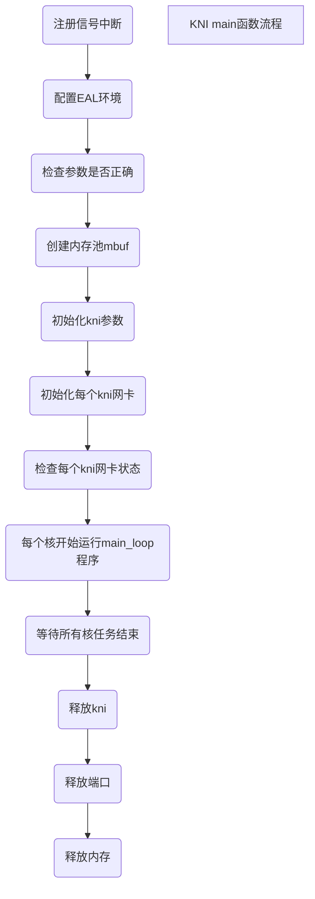
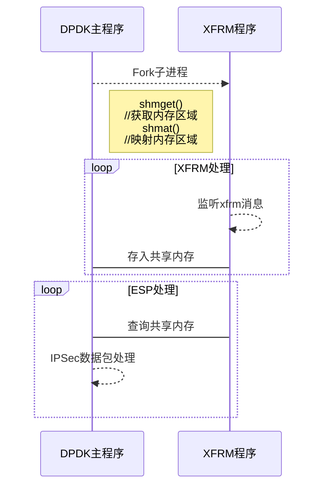

第3章 IPSec网关设计
	3.1 IPSec网关设计与实现
​	本程序主要涉及IPSec的IKE和ESP两部分，IKE用作协商密钥和传输规则，而ESP用来传输数据的。IKE又分为IKEv1和IKEv2两个版本。由于IKE阶段数据包较少，实现非常复杂，因此可以使用其他IPSec VPN实现IKE过程，ESP阶段数据量巨大，实现相对容易，需要使用DPDK进行加速。ESP部分通信数据加解密使用对称加密算法，若使用软加密，则加密速度成为瓶颈，可使用硬加密来提升加密速度。
	由于ESP部分需要加密，而IKE部分不需要加密，当数据到达网卡后，需要对数据进行分流，ESP部分交由DPDK进行处理，而IKE和其他数据需要传入Linux内核协议栈。DPDK和Linux内核态协议栈交换报文有两种模式：KNI或TUN/TAP。KNI比Linux现有的TUN/TAP接口速度更快，因为和TUN/TAP相比，KNI消除了系统调用和其数据拷贝。本程序采用KNI来实现DPDK和Linux内核态协议栈通信。当数据到达网卡后，DPDK取到数据，获取数据包IP头的协议类型，若是IPv4或IPv6的ESP协议，则交由DPDK继续处理，否则交由Linux内核进行处理。这样就完成了分流功能。
	ESP部分需要IKE协商的SA安全联盟和SP安全策略。在Linux内核2.6以后，内核实现了IPSec传输部分(ESP和AH)和XFRM框架。因此IPSec VPN有两种方案，第一种方案：IPSec VPN实现IKE部分并使用自己的ESP／AH程序来处理数据包。第二种方案：IPSec VPN实现IKE部分，并使用XFRM框架将A安全联盟和SP安全策略传给内核，由内核处理ESP／AH数据包。本程序实现类似内核的ESP部分。使用StrongSwan完成IKE部分，配置开启StrongSwan的IKEv1和IKEv2，配置StrongSwan使用内核IPSec。使用NetLink的libnl库监听IPSec VPN传给内核的SA安全联盟和SP安全策略，并将其传给DPDK的ESP部分程序，而内核虽然收到了SA安全联盟和SP安全策略，但是由于第一步ESP数据被分流给DPDK进行处理，内核IPSec VPN收不到ESP数据。
	虽然DPDK高速转发性能非常出色，但是DPDK没有协议栈。Linux内核使用ARP协议IP和MAC映射关系。而DPDK协议栈处理ESP数据包时，由于没有ARP协议，难以生成以太网头源Mac和目的Mac。当数据的到达网卡后，IKE部分数据通过KNI被分流到内核。本程序使用内核的ARP协议解析MAC地址，并解析发往内核的IKE数据包，解析IKE数据包的以太网头和IP头，并保存以太网中的MAC地址和IP头存入数组，用作后续ESP协议通过IP查询MAC地址来生成以太网头。

​	3.2 KNI内核协议栈转发

如图所示，KNI在内核注册一个网卡设备，常见的网卡配置工具可以直接配置该网卡信息，通过基于FIFO机制来同步控制信息，网络数据使用共享内存来实现。


如图KNI环境初始化流程如图



数据的处理流程如图

```flow
st=>start: 开始
op1=>operation: 从物理网卡获取数据
op2=>subroutine: 交由DPDK程序继续处理
op3=>operation: 写入KNI待发送数组
op4=>operation: 从KNI网卡读数据写入物理网卡
op5=>operation: 将KNI待发送数组数据写入物理网卡
cond1=>condition: 遍历每块网卡
cond2=>condition: 为监听的KNI网卡
cond3=>condition: 是否为ESP数据包
e=>end: 结束
st->op4->op1->cond2
cond2(yes)->cond3
cond2(no)->op2
cond3(yes)->op2
cond3(no)->op3
op3->op5->e

```

​	3.3 XFRM监听设计

​	DPDK处理数据包和XFRM获取IPSec协商结果为两个并行操作，可通过多进程或多线程的方式实现并行操作。若使用多进程，进程间通信方式有：管道，信号，消息队列，信号量，共享内存，原始套接字。

​	在Linux系统中，进程是资源分配的最小单位，线程是调度的最小单位。多进程数据共享复杂，需要IPC(进程间通信)，但数据同步复杂，而多线程数据在同一个线程中，共享简单，数据同步复杂。和多线程相比，多进程完全复制内存空间，占用空间多，切换复杂，CPU利用率低，创建销毁速度慢，切换复杂。多进程编程和调试相对简单。和多线程比，多进程间不会相互影响，而多线程中一个线程挂掉可能导致整个进程挂掉。多进程适合多核心多机分布，扩展到多台机器比较简单，而多线程适合多核分布。结合上述有缺点，本程序只需要两个并行任务，不需要频繁创建销毁，任务间通信数据量不大，因此使用多线程。

​	由于进程间资源隔离，通常进程间不可互相访问。但很多情况下进程通信不可避免，需要进程通过内核或其他进程间通信来完成。常见的进程间通信应用场景有：数据传输、事件通知、共享数据、进程控制、资源共享。管道有三种：无名管道PIPE、流管道、有名管道FIFO。无名管道只能父子间通信，并且只能单向流动。流管道可以在父子间双向传输。有名管道可以在多个不相关进程间通信。管道是内核管理的一块缓冲区，空间不大，数据结构为环形以便重复利用。若管道中没有数据，则读取进程会一直等待，直到写进程写入数据；若管道写满，写进程会一直等待，直到读进程取出数据。当两个进程终止之后，管道也会消失。信号可以发给进程，无需知道进程状态，进程若被挂起，当进程恢复执行时才传给进程。若进程阻塞信号，信号传递讲被延迟，知道取消阻塞才继续被传递。信号是一种异步通信方式，来源有硬件和软件。套接字常用于网络间通信，也可用于进程间通信。由于管道，FIFO，消息队列等都使用内核进行通信，而系统调用是用户空间和内核空间的唯一接口，并且需用户态和内核态进行数据复制，消耗比较大，而本程序对实施性要求比较高，因此这几种方案不可取。而共享内存是通过将同一块内存区映射到不同进程地址空间中，不经过内核，因此共享内存是IPC中速度最快的，但共享内存需要用户来操作并且同步也需要用户来完成。因此本程序采用最复杂的mmap共享内存完成，并使用CAS无锁技术来避免加锁，提高性能。



​	xfrm使用netlink机制来实现ipsec用户态程序和内核通信。netlink是Linux内核与用户空间进程通信的一种机制，类似于UDP协议，也是网络应用程序与内核通信最常见的接口。netlink是一种异步通信机制，在内核和用户态之间，传递消息存不用等待存在在socket缓冲队列中即可，而系统调用和ioctl是同步通信机制。本程序采用libnl库来实现捕获应用程序发往内核的ipsec的sa和sd。

用户态VPN->内核(被捕获)

```sequence
Title: XFRM监听模块流程
客户端->VPN: IKE密钥协商
VPN->XFRM监听程序: 捕获发往内核SA和SD
Note over XFRM监听程序,DPDK主程序: 共享内存获取会话信息
Note over 客户端,DPDK主程序: 客户端与DPDK主程序建立
客户端-->DPDK主程序: 互相发送ESP通信数据包
DPDK主程序-->客户端:
```

​	3.4 IP-Mac映射表

​			Mac地址获取如图，当数据不为ESP数据包时，其他数据(如ARP,ICMP,TCP,UDP)走KNI网卡，若数据为UDP协议，目标地址为KNI网卡IP，端口为500时，此数据包为IKE通信数据包，可将该数据包的IP和端口作为一组IP和MAC映射表存入数组以备查询使用，以太网头、IP头、UDP头如下：

​			UDP数据封装

​			以太网头:目的地址(6)|源地址(6)|帧类型(2)

​			IP头:

​					版本(4)|首部长度(4)|服务类型(8)|总长度(16)|

​					标识(16)|标志(3)|片偏移(13)|

​					TTL(8)|协议(8)|首部校验和(16)|

​					源IP地址(32)|

​					目的IP地址(32)|

​			UDP头:

​				源端口(8)|目的端口(8)|包长度(8)|校验和(8)

```flow
st=>start: 开始
op1=>operation: 获取数据包
op2=>operation: 获取原IP地址源地址和目的IP目的地址
op3=>operation: 将子网范围的IP有效位作为索引存入数组以备查询
op4=>operation: 交由DPDK程序继续处理
op5=>operation: 交由KNI继续处理
cond1=>condition: 是否为ESP数据包
cond2=>condition: 是否为UDP数据包
cond3=>condition: 目的端口是否为500

e=>end: 结束
st->op1->cond1
cond1(yes)->op4
cond1(no)->cond2
cond2(no)->op5
cond2(yes)->cond3
cond3(yes)->op2->op3->e
cond3(no)->op5


```

​			